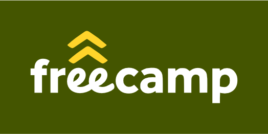

# Freecamp web 2016

This repo is the source code for http://freecamp.es.

## Why static?

Since we're only trying to learn and teach things we thought that using WP is far from being the best learning experience.
Most of times 'shit' works and you don't know the reason why.

Using *github pages* is very crafty approach that is exactly what we were looking for.

# The pupils

The web will have posts written from our 2016 edition pupils, yet to come.

# The teachers

A set of freaks investing their precious time in sharing their experiences and knowledge just because is the right thing to do.

